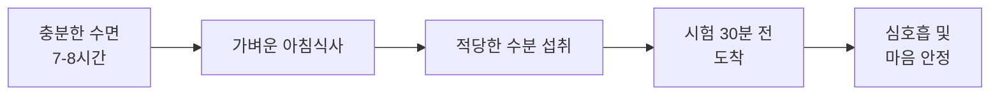
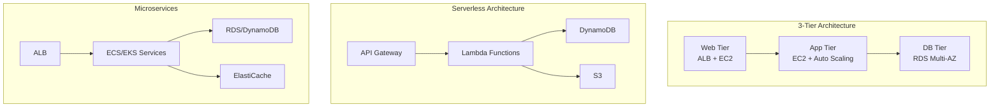
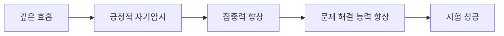

# Day 28: AWS SAA-C03 시험 준비 가이드

## 학습 목표
- 시험 당일 준비사항 점검
- 핵심 개념 최종 복습
- 시험 전략 및 팁 숙지
- 마음가짐 및 컨디션 관리

## 시험 준비 가이드

### 1. 시험 전날 준비사항

#### 기술적 준비
- **시험 환경 점검**
  - 컴퓨터 및 인터넷 연결 상태 확인
  - 웹캠, 마이크 테스트
  - 시험 소프트웨어 설치 및 테스트
  - 백업 인터넷 연결 준비

- **신분증 및 서류 준비**
  - 유효한 신분증 2개 준비
  - 시험 확인서 출력
  - 응급 연락처 정리

#### 학습 마무리
- **가벼운 복습만 진행**
  - 치트 시트 한 번 더 훑어보기
  - 헷갈리는 개념만 간단히 정리
  - 새로운 내용 학습 금지

### 2. 시험 당일 준비

#### 컨디션 관리

#### 시험 환경 설정
- **조용한 공간 확보**
  - 방해받지 않는 독립된 공간
  - 책상 위 정리정돈
  - 필요 없는 물건 제거

- **응급상황 대비**
  - 기술 지원팀 연락처 준비
  - 백업 계획 수립
  - 시간 여유 확보

### 3. 핵심 개념 최종 점검

#### AWS 서비스 분류별 핵심 포인트

**컴퓨팅 서비스**
- EC2: 인스턴스 타입, 스토리지 옵션, 보안 그룹
- Lambda: 서버리스, 트리거, 제한사항
- ECS/EKS: 컨테이너 오케스트레이션 차이점

**스토리지 서비스**
- S3: 스토리지 클래스, 수명주기, 보안
- EBS: 볼륨 타입, 스냅샷, 암호화
- EFS: NFS, 성능 모드, 처리량 모드

**데이터베이스 서비스**
- RDS: 엔진 선택, Multi-AZ, Read Replica
- DynamoDB: NoSQL, 파티션 키, GSI/LSI
- ElastiCache: Redis vs Memcached

**네트워킹 서비스**
- VPC: 서브넷, 라우팅, NAT Gateway
- CloudFront: CDN, 오리진, 캐싱
- Route 53: DNS, 라우팅 정책

#### 아키텍처 패턴 복습

### 4. 시험 전략 및 팁

#### 시간 관리 전략
- **총 시험 시간: 130분 (2시간 10분)**
- **문제 수: 65문제**
- **권장 시간 배분:**
  - 1차 풀이: 90분 (문제당 평균 1.4분)
  - 검토 및 수정: 40분

#### 문제 해결 접근법

**1단계: 문제 분석**
- 핵심 키워드 식별
- 요구사항 명확화
- 제약조건 파악

**2단계: 선택지 분석**
- 명백히 틀린 답 제거
- 남은 선택지 비교
- 최적 솔루션 선택

**3단계: 검증**
- 선택한 답이 모든 요구사항 충족하는지 확인
- 비용 효율성 고려
- 보안 및 가용성 검토

#### 자주 나오는 함정 피하기

**비용 최적화 문제**
- Reserved Instance vs Spot Instance 구분
- S3 스토리지 클래스 선택
- 데이터 전송 비용 고려

**보안 문제**
- IAM 정책 vs 리소스 기반 정책
- 암호화 옵션 (전송 중 vs 저장 시)
- VPC 보안 그룹 vs NACL

**가용성 문제**
- Multi-AZ vs Multi-Region
- Auto Scaling vs Load Balancing
- 백업 및 복구 전략

### 5. 마음가짐 및 심리적 준비

#### 긍정적 마인드셋
- **자신감 유지**
  - 4주간의 체계적 학습 완료
  - 충분한 실습 경험 보유
  - 모의고사를 통한 검증 완료

- **침착함 유지**
  - 모르는 문제가 나와도 당황하지 않기
  - 추측이라도 답 선택하기
  - 시간에 쫓기지 않기

#### 스트레스 관리

### 6. 시험 후 계획

#### 합격 시
- 자격증 활용 계획 수립
- 추가 AWS 자격증 준비 고려
- 실무 프로젝트 적용 방안 모색

#### 불합격 시
- 부족한 영역 분석
- 재시험 일정 계획
- 추가 학습 자료 확보

## 최종 점검 체크리스트

### 기술적 준비
- [ ] 시험 환경 테스트 완료
- [ ] 신분증 및 서류 준비
- [ ] 인터넷 연결 안정성 확인
- [ ] 백업 계획 수립

### 학습 준비
- [ ] 핵심 개념 복습 완료
- [ ] 치트 시트 최종 점검
- [ ] 모의고사 오답 재검토
- [ ] 시험 전략 숙지

### 컨디션 관리
- [ ] 충분한 수면 계획
- [ ] 시험 당일 일정 정리
- [ ] 스트레스 관리 방법 준비
- [ ] 긍정적 마인드셋 유지

## 격려 메시지

🎯 **4주간의 여정을 완주하신 것을 축하합니다!**

여러분은 이미 충분히 준비되었습니다. 체계적인 학습과 꾸준한 실습을 통해 AWS Solutions Architect로서의 기초를 탄탄히 다졌습니다. 

시험은 여러분의 지식을 확인하는 과정일 뿐입니다. 자신감을 가지고, 침착하게 임하세요. 

**여러분의 성공을 응원합니다! 🚀**

---

*"성공은 준비된 자에게 찾아온다" - 준비는 이미 끝났습니다. 이제 결과만 남았습니다.*