# AWS SAA-C03 시험 팁 및 전략

## 시험 개요 및 구조

### 시험 기본 정보
- **시험 코드**: SAA-C03
- **시험 시간**: 130분 (2시간 10분)
- **문제 수**: 65문제
- **합격 점수**: 720점 (1000점 만점)
- **문제 유형**: 객관식, 복수 정답
- **시험 방식**: 온라인 또는 시험 센터

### 도메인별 출제 비중
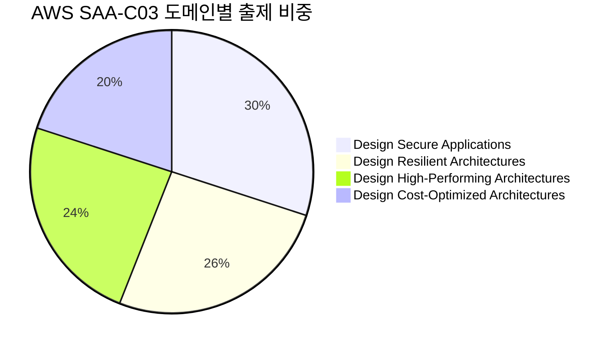

## 시험 전략

### 1. 시간 관리 전략

#### 권장 시간 배분
```mermaid
gantt
    title 시험 시간 관리 전략 (130분)
    dateFormat X
    axisFormat %M분
    
    section 1차 풀이
    문제 1-20    :0, 28
    문제 21-40   :28, 56
    문제 41-65   :56, 90
    
    section 검토
    어려운 문제 재검토 :90, 115
    전체 답안 점검     :115, 130
```

#### 시간 관리 팁
- **1분 30초 룰**: 문제당 평균 1분 30초 이내로 해결
- **플래그 시스템**: 어려운 문제는 플래그하고 나중에 검토
- **시간 체크**: 20문제마다 시간 확인
- **마지막 10분**: 빈 답안 확인 및 최종 점검

### 2. 문제 해결 접근법

#### STAR 방법론 적용
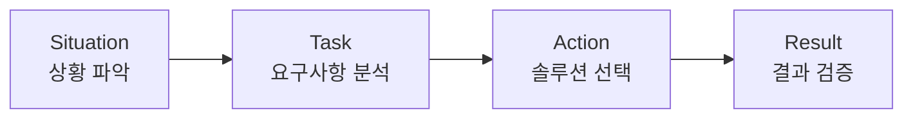

**Situation (상황 파악)**
- 현재 아키텍처 이해
- 문제점 또는 개선점 식별
- 제약조건 파악

**Task (요구사항 분석)**
- 기능적 요구사항 (성능, 가용성)
- 비기능적 요구사항 (비용, 보안)
- 우선순위 결정

**Action (솔루션 선택)**
- 가능한 AWS 서비스 나열
- 각 옵션의 장단점 비교
- 최적 솔루션 선택

**Result (결과 검증)**
- 모든 요구사항 충족 확인
- 부작용 또는 제약사항 검토
- 최종 답안 확정

### 3. 선택지 제거 전략

#### 4단계 제거 방법
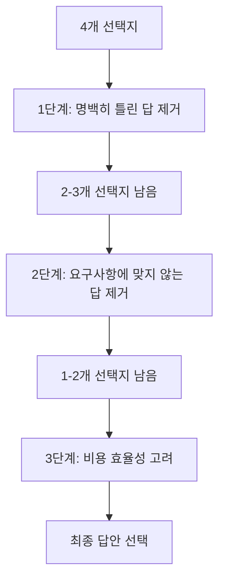

**1단계: 명백한 오답 제거**
- 존재하지 않는 서비스
- 잘못된 서비스 조합
- 기술적으로 불가능한 솔루션

**2단계: 요구사항 불일치 제거**
- 성능 요구사항 미충족
- 보안 요구사항 미충족
- 가용성 요구사항 미충족

**3단계: 비용 효율성 고려**
- 과도한 리소스 사용
- 불필요한 고가 서비스
- 운영 복잡성 증가

## 문제 유형별 전략

### 1. 아키텍처 설계 문제

#### 접근 방법
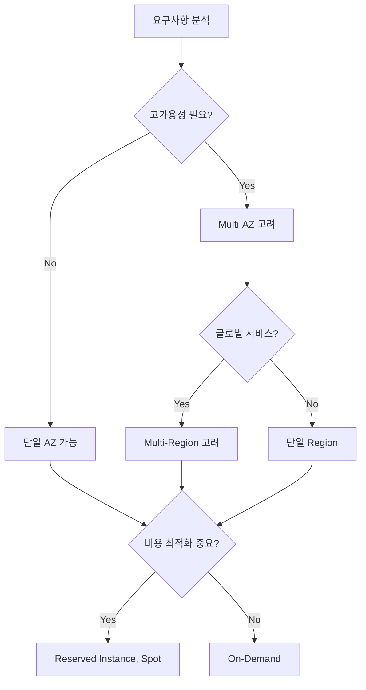

#### 핵심 고려사항
- **가용성**: Multi-AZ, Auto Scaling, Load Balancer
- **확장성**: Horizontal vs Vertical Scaling
- **보안**: 네트워크 분리, 암호화, 액세스 제어
- **비용**: 적절한 인스턴스 타입, 예약 인스턴스

### 2. 서비스 선택 문제

#### 결정 트리 활용
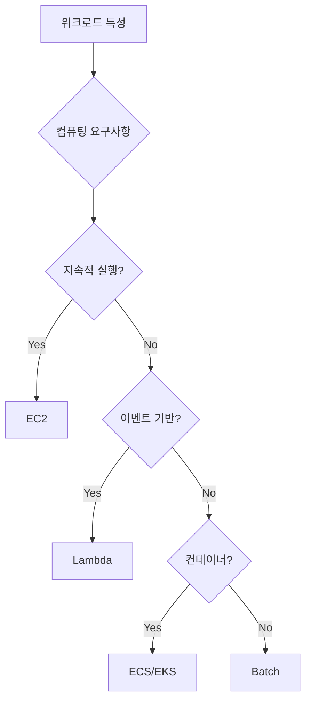

#### 서비스별 선택 기준

**컴퓨팅 서비스**
- EC2: 완전 제어, 지속적 워크로드
- Lambda: 이벤트 기반, 단기 실행
- Fargate: 서버리스 컨테이너
- Batch: 배치 처리 작업

**스토리지 서비스**
- S3: 객체 스토리지, 웹 애플리케이션
- EBS: 블록 스토리지, 데이터베이스
- EFS: 공유 파일 시스템
- FSx: 고성능 파일 시스템

### 3. 문제 해결 및 최적화 문제

#### 성능 최적화 접근법
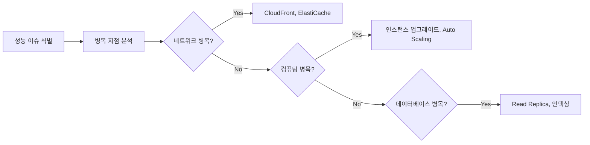

#### 비용 최적화 접근법
- **Right Sizing**: 적절한 인스턴스 크기 선택
- **Reserved Instance**: 예측 가능한 워크로드
- **Spot Instance**: 중단 가능한 워크로드
- **S3 Intelligent-Tiering**: 자동 스토리지 최적화

## 자주 출제되는 시나리오

### 1. 재해 복구 (DR) 시나리오

#### DR 전략별 특징
| 전략 | RTO | RPO | 비용 | 복잡성 |
|------|-----|-----|------|--------|
| Backup & Restore | 시간~일 | 시간 | 낮음 | 낮음 |
| Pilot Light | 10분~시간 | 분~시간 | 중간 | 중간 |
| Warm Standby | 분~10분 | 분 | 높음 | 높음 |
| Multi-Site | 실시간 | 실시간 | 매우 높음 | 매우 높음 |

### 2. 마이그레이션 시나리오

#### 마이그레이션 전략 (6R)
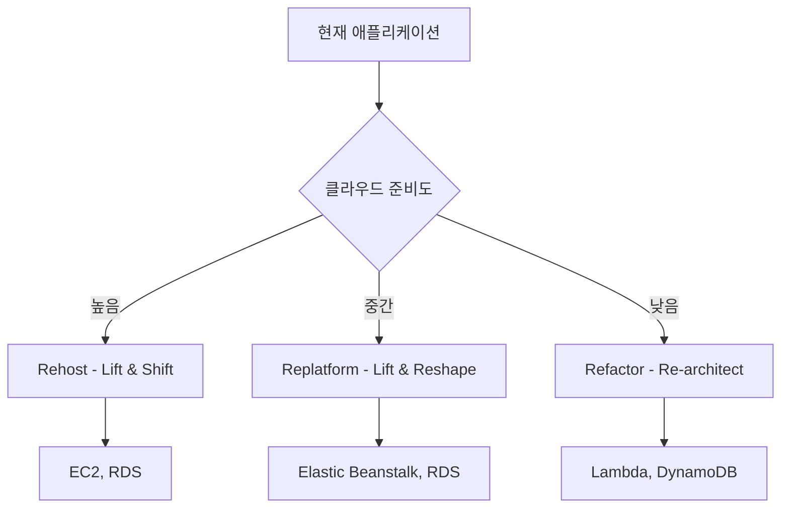

### 3. 보안 강화 시나리오

#### 보안 계층별 솔루션
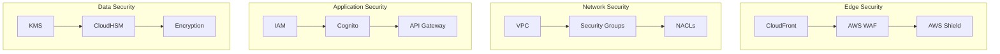

## 함정 문제 대응 전략

### 1. 과도한 솔루션 함정
- **문제**: 요구사항보다 과도하게 복잡한 솔루션 제시
- **대응**: 최소 요구사항을 만족하는 가장 간단한 솔루션 선택

### 2. 비용 무시 함정
- **문제**: 기능만 고려하고 비용 효율성 무시
- **대응**: 동일한 기능을 제공하는 솔루션 중 가장 비용 효율적인 옵션 선택

### 3. 보안 간과 함정
- **문제**: 편의성을 위해 보안 요구사항 무시
- **대응**: 보안 요구사항을 항상 우선순위로 고려

### 4. 단일 장애점 함정
- **문제**: 고가용성이 필요한 상황에서 단일 장애점 존재
- **대응**: Multi-AZ, 로드 밸런싱, 자동 장애 조치 고려

## 시험 당일 실전 팁

### 시험 시작 전
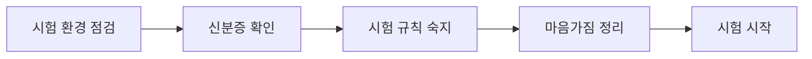

### 문제 풀이 중
- **키워드 하이라이트**: 중요한 요구사항에 밑줄
- **메모 활용**: 복잡한 아키텍처는 간단히 스케치
- **시간 체크**: 20문제마다 시간 확인
- **플래그 활용**: 어려운 문제는 나중에 재검토

### 검토 단계
- **빈 답안 확인**: 모든 문제에 답변했는지 확인
- **플래그된 문제**: 어려웠던 문제 재검토
- **실수 확인**: 단순 실수나 오타 점검
- **시간 관리**: 마지막 5분은 전체 점검

## 심리적 준비 및 마인드셋

### 긍정적 마인드셋 유지
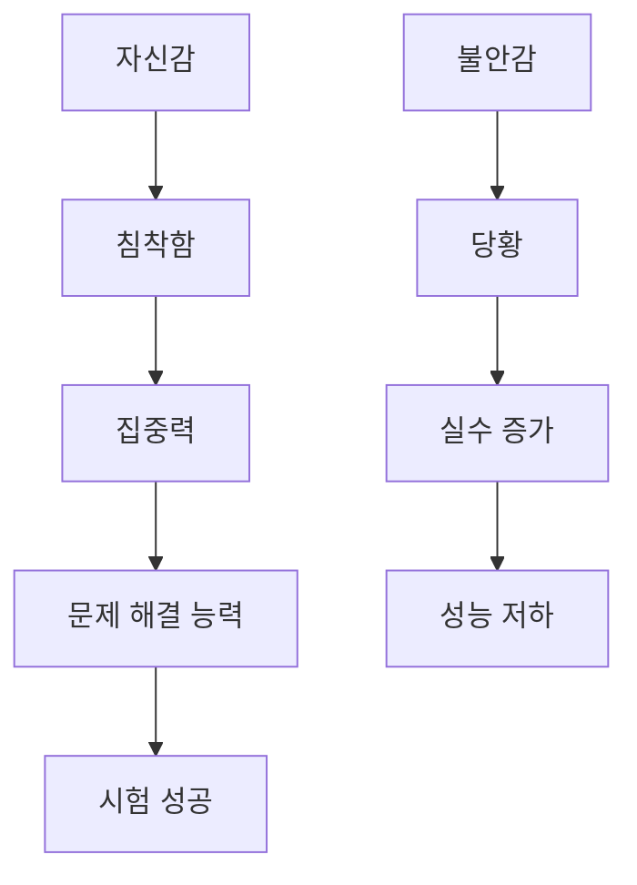

### 스트레스 관리 기법
- **심호흡**: 긴장될 때 깊게 숨쉬기
- **긍정적 자기암시**: "나는 충분히 준비했다"
- **문제 분할**: 복잡한 문제를 작은 단위로 나누기
- **시간 압박 무시**: 시간에 쫓기지 말고 차근차근

### 실패에 대한 대비
- **재시험 계획**: 만약의 경우를 대비한 계획 수립
- **학습 기회**: 부족한 부분을 파악하는 기회로 활용
- **지속적 개선**: 경험을 바탕으로 한 지속적 학습

## 최종 점검 체크리스트

### 기술적 준비
- [ ] 시험 환경 테스트 완료
- [ ] 백업 인터넷 연결 준비
- [ ] 필요한 소프트웨어 설치
- [ ] 시험 규칙 및 절차 숙지

### 학습 준비
- [ ] 핵심 개념 최종 복습
- [ ] 자주 헷갈리는 개념 정리
- [ ] 시험 전략 및 팁 숙지
- [ ] 모의고사 오답 재검토

### 심리적 준비
- [ ] 충분한 휴식 및 수면
- [ ] 긍정적 마인드셋 유지
- [ ] 스트레스 관리 방법 준비
- [ ] 시험 후 계획 수립

## 성공을 위한 마지막 조언

### 시험 중 기억할 점
1. **침착함 유지**: 모르는 문제가 나와도 당황하지 않기
2. **시간 관리**: 한 문제에 너무 오래 매달리지 않기
3. **전략적 추측**: 모르는 문제도 논리적으로 추측하기
4. **검토 시간 확보**: 마지막 20분은 검토를 위해 남겨두기

### 합격을 위한 핵심
- **70% 이상 정답**: 65문제 중 약 45-50문제 정답 필요
- **도메인별 균형**: 모든 도메인에서 기본 이상의 점수 확보
- **실무 관점**: 이론보다는 실무적 관점에서 접근
- **AWS 모범 사례**: AWS가 권장하는 방식 우선 고려

---

**🎯 시험 성공 공식**
```
준비된 지식 + 올바른 전략 + 침착한 마음 = 합격
```

**여러분은 이미 충분히 준비되었습니다. 자신감을 가지고 시험에 임하세요!**

**AWS Solutions Architect Associate 자격증 취득을 진심으로 응원합니다! 🚀**